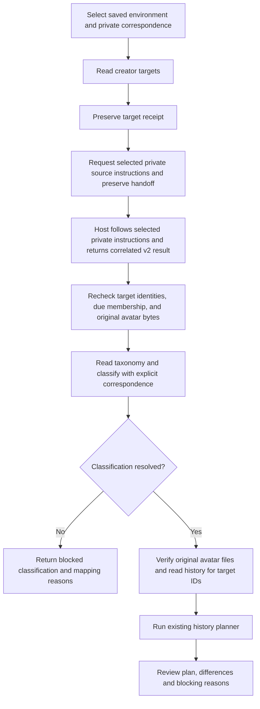

# Selected-environment invitation reading and planning

This entry implements target preparation and category-preserving planning from
the saved environment. The user invokes the Skill; the Skill asks Runtime for
`record-dataset-read/v1`. Runtime resolves the fixed Provider and its private
configuration. No service SDK, credential store or service field representation
is used by this entry. The existing legacy client route is retained separately.

This is a development implementation, not a distributed or accepted production
workflow. A prepared plan is not registration authority and always has
`businessWorkflowVerified: false`. The selected write adapter uses
`record-dataset-write/v1`; it never supplies service IDs, credentials or an
approval flag.

## Inputs and their owners

The selected environment and its generation are explicit inputs. Install this
Skill alongside the selected Runtime; Runtime owns loading fixed Provider
packages. Do not select a checkout or infer a production environment from an
open browser session.

The datastore Provider receives its `configurationRef` and `configurationSha256`
from Runtime. That private configuration maps dataset aliases and logical fields
to authorized resources, finite read budgets, types and queries. The request
cannot replace it. Duplicate JSON member names must be rejected during private
configuration preparation; this entry receives an already parsed object.

A separate private Skill correspondence file maps logical results to business
roles. It contains no API paths, credentials or transformations. Its environment
must match the saved selection. This synthetic example shows its entire shape:

```json
{
  "schemaVersion": 1,
  "environment": {
    "environmentId": "example",
    "environmentKind": "development",
    "platformId": "example-platform"
  },
  "creators": {
    "dataset": "people",
    "queries": {"all": "everyone", "due": "pending"},
    "fields": {"account": "handle"}
  },
  "statuses": {
    "dataset": "taxonomy",
    "query": "all",
    "fields": {"label": "title", "parent": "parent"}
  },
  "history": {
    "dataset": "history",
    "query": "byPerson",
    "fields": {
      "creatorRecordId": "person", "state": "status",
      "externalUserId": "uid", "nickname": "name",
      "observedAtMs": "time", "avatarHashes": "images"
    }
  },
  "categories": [{"statusId": "example-child", "invitationCategory": "example-category"}]
}
```

The creator account and status label are scalar
strings. A status parent is a scalar reference or `null` for a root. History's
creator is exactly one reference; state is a scalar string; observation time is
a positive integer in epoch milliseconds. External ID and nickname are strings
or explicitly optional `null`, which means blank. Avatar hashes are an array of
content SHA-256 values, including `[]` only for no attachments. The Provider must
hash original bytes; a failed image read cannot produce an empty array.

`categories` is explicit reviewed correspondence, never a rule inferred from
child labels. An empty correspondence array is valid where categories are not
configured; an observed unmapped category still stops planning. Additional
refinements use the adopted [classification and evidence](invitation-classification.md)
contract. Do not copy actual platform labels or private classification rules
into the public Skill.

## Procedure and checkpoints



Read failures at any stage stop the procedure. They do not become an empty
master or history. `due`, `selected` and `all` preserve the legacy selection
semantics, including normalization, duplicate checks before an optional limit,
and the user's selected order. No implicit 100-target cap is introduced.

1. Select the saved environment file, its current generation and the reviewed
   private correspondence file's byte SHA-256. Store private JSON files with
   owner-only permissions. Use explicit absolute paths for all file arguments.
2. Run `scripts/invitation_environment.mjs targets` with `--environment`,
   `--generation`, optional `--platform`, `--configuration`,
   `--configuration-sha256`, `--output`, and optional `--mode` / `--limit`.
   For `--mode selected`, repeat `--account` in the requested order. Preserve
   the resulting receipt, including the manifest and Provider read identity.
3. Run `source` with the target receipt. Runtime selects
   `creator-invitation-observation-source/v2` version `2` and returns private
   instructions bound to the complete manifest. The host follows those
   instructions only after separately confirming its current actor, session and
   agency; correlation does not establish any of them. Store the private
   handoff, then run `source-plan` with the receipt, handoff and returned result.
   It accepts only a correlated done result in
   `invitation-eligibility-observations/v2`, preserves request/binding/result
   digests, and then uses the same plan path below. Synthetic or historical
   output never authorizes an observation. `planSha256` retains its existing
   scope over the core plan result; it does not cover additive source provenance.
4. `source-plan` takes `--targets`, `--source-handoff`, `--source-result`,
   optional `--refinements`, and a new `--output`; the existing narrower `plan`
   takes `--targets` and `--observations`. Both recheck the same
   environment/generation and correspondence arguments, creator identities and due
   membership, read the complete authorized taxonomy, and search history
   only for target IDs. Zero targets or unresolved classification causes zero
   history requests. Service acquisition limits belong to the Provider.
5. Inspect `status`, `classification`, `plan`, `reads` and `planSha256`. The plan
   preserves timestamp-only updates for identical states, new history for state
   changes, conflicting identity/latest-time stops, and due freshness checks.
   `blocked` must be resolved; it is not permission to omit affected rows.

Programmatic callers use `prepareEnvironmentInvitationTargets`,
`prepareEnvironmentInvitationSource`, `prepareEnvironmentInvitationSourcePlan`,
and `prepareEnvironmentInvitationPlan` from the package's `./environment` export.
The raw normalized-observation route retains its narrower assurance; only the
source route records Runtime instruction correlation.
The CLI additionally checks private-file permissions and fixed input bytes.

## Selected write and reconciliation

After reviewing an unblocked plan, use `write-prepare` with the common pinned
configuration/environment arguments, `--targets`, `--prepared-plan` and a new
`--output`. It validates the saved plan hash and rechecks the same reader,
configuration, targets, taxonomy, history and original avatar bytes. Changed
business effects stop preparation. The Provider binds logical fields, current
baselines and images to the resulting `intentSha256`. History status references
resolve through the current status master before comparison with business labels.
Retained label inputs are accepted only when they identify exactly one master
entry; unknown or ID/label-ambiguous values stop. Creates use the classified
status ID in the logical status field, preserving reference identity independently
of its display label.

Review that intent together with the original `planSha256` and counts. After
explicit authorization, `write-apply` requires those same inputs plus
`--prepared-write`, `--expect-intent-sha256`, `--expect-plan-sha256`,
`--confirm-create`, `--confirm-update`, `--confirm-attach`,
`--confirm-already-applied`, and `--journal`. Attachment count includes
new-row images and existing-row resumes. The journal must be a new file in a
canonical absolute owner-only directory (mode 0700). The CLI persists and
synchronizes each awaited event before execution proceeds. An existing journal
stops apply, including after interruption. Flags bind an already authorized
operation; they do not independently grant authority.

Programmatic callers pass `{access,configuration,targets,preparedPlan}` to
`prepareEnvironmentInvitationWrite`. Apply additionally requires the returned
`preparedWrite` and `execution:{authorizeIntent,onEvent}`. These trusted
functions are passed through Runtime's existing second invoke argument; no new
host adapter is required. The callback must validate the exact reviewed intent
and the event sink must durably preserve every event. Both CLI and API recheck
the business plan before apply and require complete zero-write business
replanning after Provider confirmation before reporting verified completion.

On a stopped or uncertain result, retain the private plan, intent and journal.
Run `write-reconcile` with the same pinned inputs, `--prepared-write` and
`--journal`. The API takes the same parameters plus the saved `events` array.
This is readback only and returns `confirmed`, `missing`, `conflict` or
`unknown`; confirmed also requires the business readback. A truncated or
unreadable journal stops recovery. Preserve it for inspection rather than
inventing lost acknowledgement evidence.

For example, if a new history row was created but its image attachment failed,
retain its returned ID and reconcile. A newly reviewed residual plan may then
contain only an existing-row image resume. Never delete the journal, replay
an uncertain create, or fabricate returned IDs. Changed or residual effects
require a new plan and the applicable explicit authorization. Synthetic tests
prove local composition behavior only; live acceptance remains separate.

## Human review, failures and recovery

A human can trace each creator from the target receipt's `manifest.rows` to the
source observation, `classification.classifications` and proposed operations
in `plan`. Use the private query references to inspect the selected status
master and history when reviewing why an operation was selected. Read receipts identify the query and target-ID
scope without implying a transactionally consistent snapshot across requests.
Compare parent meaning and category correspondence using the reviewed private
material; an opaque ID or successful type check alone cannot establish meaning.

`stopped` denotes execution/configuration failure; `blocked` retains domain
diagnostics. CLI exit status is 2 for either. Provider failure artifacts preserve
the original safe `providerError`, cause code, stage and request correlation.
Stdout/stderr summaries do not print raw records or service responses. If even
the private diagnostic cannot be written, `evidenceCode` reports that additional
failure without replacing the original error.

For changed selection, mapping, target identity or incomplete history, retain
the failed artifact, correct the relevant owner's input and prepare a new target
receipt/plan. Hashes detect changed inputs; they do not constitute approval.
Preparation and reconciliation do not mutate. After apply, preserve the durable
journal and use the readback procedure above before considering another write.
Keep legacy receipts unchanged; do not pass this plan to a legacy apply command.
