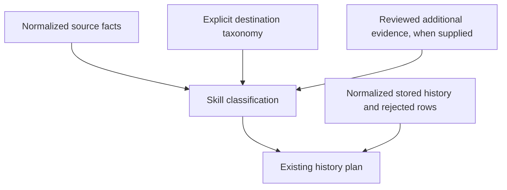

# Invitation category and reviewed classification

The source Provider acquires and normalizes source facts according to documented
platform meaning. The Skill owns use-case classification in the destination.
Public helpers contain no service
labels or source-screen rules. Authorized operators obtain the source meanings
and observation procedure from the selected private Provider's packaged knowledge.

The opt-in v3 input separates `status` from the Provider-retained raw `reason`.
The classifier maps only `status` to an exact destination root. An unknown raw
reason therefore remains observable without inventing a destination state;
an unknown status still rejects classification. Provider-supplied abstract
compliance signals may select a child only through an explicit reviewed
`complianceRules` entry. The current selected-environment handoff remains v2
until a separately reviewed Provider/Skill composition selects v3.

The planning helpers follow this flow without performing external operations.
Their selected-environment connection is not yet implemented.

# Inputs and procedure

1. Keep the exact existing target manifest and complete observations in private
   evidence storage. Deliberately select `invitation-eligibility-observations/v2`:
   it retains every v1 field and requires `invitationCategory` on every creator.
   A category is an opaque nonempty string or `null`. An unobserved result must
   retain both eligibility and category as `null`. Never upgrade v1 by guessing
   which category was omitted.
2. Supply a reviewed destination taxonomy as `statuses` nodes with unique `id`
   and `label`, and `parentId: null` for roots. Children reference a direct root;
   an optional `invitationCategory` maps that root/category pair to one child.
   Labels must be exact existing destination states. This helper does not read
   the destination or establish its historical meaning: the selected caller must
   review the actual destination options, history meanings and field bindings.
3. For an observed row, match eligibility to an exact root label. A non-null
   category selects its exact configured child; a null category retains the
   root. Other child classifications require `refinements` evidence with
   `{accountKey, statusId, evidenceRef}`. Each evidence reference must identify
   reviewed private evidence; nonempty text alone does not prove its truth.
   A refinement must remain under the observed root and cannot contradict a
   category-selected child. Without evidence, do not infer a risk or other child.
4. Import `classifyInvitationEligibilityObservations`,
   `buildClassifiedInvitationRefreshPlanFromHistory`, or the existing
   `buildClassifiedInvitationRefreshPlan` from `./invitation-classification`.
   For supplied normalized history, use the `FromHistory` helper described below.
   The existing helper keeps the `buildRefreshPlan` inputs plus v2 observations,
   statuses and refinements for compatibility with the legacy service adapter.
   Inspect its `{classification, plan}` result. The classifier returns a
   structural state snapshot for the old algorithm, never falsely relabels it
   as typed v1 source evidence, and preserves identity/avatar metadata.
5. Review account coverage, each parent/child selection and evidence reference,
   `inputSha256`, `receiptSha256`, and the existing plan's creates, timestamp
   updates, attachments and blocking issues. The input hash covers observations,
   target manifest, taxonomy and refinements; changes require fresh review.
   These hashes detect change and supply no execution authority.

# Planning from normalized history

`buildClassifiedInvitationRefreshPlanFromHistory` accepts `observations`,
`manifest`, `statuses`, optional `refinements`, `storedHistory`, and optional
`invalidStored`. It returns the same `{classification, plan}` as the legacy
helper for equivalent inputs. This separates the history decision from service
response parsing; do not manufacture service-shaped records to call the old path.

Each `storedHistory` row uses the existing hydrated history representation:

| Fields | Meaning |
| --- | --- |
| `recordId`, `creatorRecordId` | Stored history and linked creator identifiers, as strings |
| `state` | Exact destination state label, as a string |
| `externalUserId`, `nickname` | Strings; retain the existing trimming and nickname NFKC normalization |
| `observedAtMs` | Positive safe-integer observation time in epoch milliseconds |
| `avatarHashes` | Array of nonblank content-hash strings; comparison retains the existing unique, sorted values. An empty array means no attachment; a blank hash is invalid history, not a missing attachment. |

The selected caller supplies normalized history and retains rejected source rows
in `invalidStored` (existing `{recordId, reason}` diagnostics). The helper also
adds malformed normalized rows to `plan.invalidStored`. These remain blocking
under `hasBlockingRefreshIssues` from `./scripts/invitation_state_core`, even if
other rows yield candidate effects. Missing history input is rejected rather
than treated as an empty table. Do not discard rejected rows to obtain a plan.

For an already classified structural observation snapshot, the same package
export provides `buildRefreshPlanFromHistory` with `observations`, `manifest`,
`storedHistory` and optional `invalidStored`. Both paths use the existing history
decision algorithm. The legacy `buildRefreshPlan` and service routes retain their
existing inputs and behavior.

These pure helper inputs do not select a Provider capability, establish historical
meaning or authorize a write. The [selected-environment workflow](environment-workflow.md)
now connects the source instruction request and correlated v2 result to these
helpers through `source` and `source-plan`. The selected source Provider owns
normalization; the host performs scoped acquisition under its private instructions.
Request/result correlation does not prove current actor/session/agency or image
ownership. The reviewed taxonomy and refinement evidence remain caller inputs.
Selected-environment writes and live acquisition acceptance remain incomplete.
If a source row cannot be normalized, preserve its diagnostic and resolve it
before applying.

# Synthetic examples and exceptions

With root `{id:"r", label:"synthetic-parent", parentId:null}` and child
`{id:"c", label:"synthetic-child", parentId:"r", invitationCategory:"synthetic-category"}`,
an observed `synthetic-parent` plus `synthetic-category` chooses `synthetic-child`.
Null category chooses `synthetic-parent`. An additional child can be selected by
an explicit reviewed evidence reference when category is null. If the category
selects a different child, stop and resolve the conflicting evidence.

An identical latest child, identity and avatar produces the existing timestamp
update; a changed child produces a new transition. Historical content is never
rewritten to make it match. The existing algorithm still detects identity
conflicts, timestamp collisions, ambiguous latest states and invalid history.

A displayed missing-account status supplied as an observed root is recorded
alongside other observed rows. Generic `not_found` or `unavailable` acquisition
outcomes instead return `blocked: true`, no structural observation snapshot and
no plan. Unknown roots/categories, duplicate mappings, missing/extra accounts
and invalid refinement evidence reject before planning. Preserve the original
inputs and obtain corrected evidence or mapping; do not replace failures with
invented states or silently shrink the target set.

# Verification, takeover and limits

A human can reproduce classification by looking up the root, then its category
child or reviewed child evidence, and comparing the chosen state with the latest
stored state and identity/avatar data. The examples above and
`test/invitation-classification.test.mjs` in the source repository cover normal
and exceptional planning behavior; tests are not evidence of human comprehension.

The pure helper performs no source reads, destination reads or writes. It does
not implement selected-environment execution, source batching, restart checkpoints
or production acceptance. Source acquisition batch limits and Runtime request
checkpoints remain separate owning concerns. A selected application must retain
the original inputs, classification receipt and actual history review, recheck
them before applying, and use the existing approved execution/readback contract.
Do not pass the structural output through a legacy path to bypass those checks.
An uncertain external result requires readback recovery, not unconditional replay.
Recovery from this planning-only step is to discard its candidate plan and rerun
with corrected reviewed inputs; no historical records need restoring.
